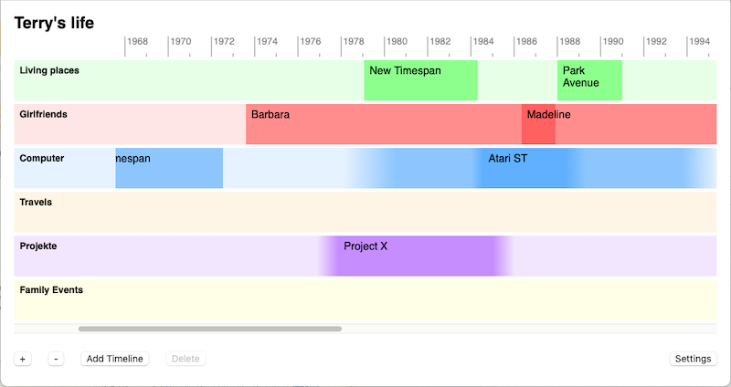
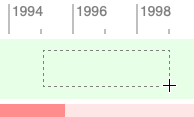
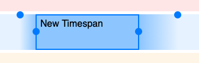
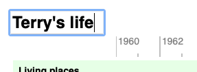
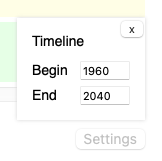
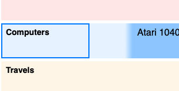
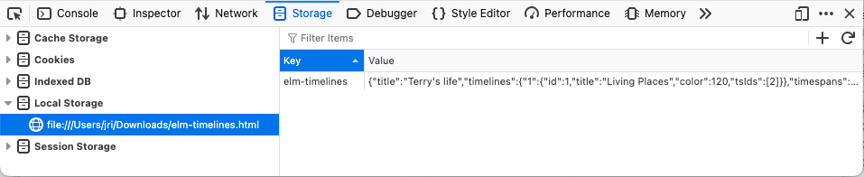

# Elm Timelines

Elm Timelines is a user interface for the creation of timelines, written in [Elm](https://elm-lang.org). You can use it e.g. as an aid for remembering your life. The special trait of Elm Timelines is that it deals with uncertainty. You're not required to enter exact dates but draw timespans within a timescale. If you're not (yet) certain about a timespan's begin or end you can add an uncertainty range. Elm Timelines visualizes this as "fade-in" resp. "fade-out" then.



Despite Elm Timelines models and visualizes time it is not a calendar application. Instead Elm Timelines provides you a canvas for your mind e.g. for your personal memory process. By visualizing different aspects of your life at the same time e.g. living places, partners, projects, the screen may inspire you with new questions and jog your memory. However Elm Timelines does not force you into any topic and you can go to the future as well.

## Setup

To use Elm Timelines just click the link below. You don't need an account. You can just start with entering data. When you revisit that link later on, your data is still there. The data you enter is stored locally *in your browser* (using `localStorage`). Your data never leaves your computer. No one else can access it.

[elm-timelines.html](https://jri.github.io/elm-timelines/elm-timelines.html)

**Note:** If you use Elm Timelines in a **Private Browser Window** data you enter will *not* be available later on. If you want store your data permanently (in your browser) don't use Elm Timelines in a private browser window.

### Working offline

Elm Timelines is a server-less application, it does not need a web server. You can download (by right-clicking) the HTML file above and open it locally in your browser. The HTML is a 42 KB standalone file, all JavaScript and CSS is embedded. No internet required from then on. The same as above applies: the data you enter is stored locally in your browser. If you reopen that HTML file (from your hard drive) later on your data is still there.

## How to use

The Elm Timelines UI consists of a global *time scale* and several thematic *timelines*. A timeline contains several *timespans*. Each timespan has a begin and an end plus respective *uncertainty ranges*. Timespans can overlap. There is also a *page title*.

To create a timespan point the mouse to a timeline and draw a rectangle.



To move a timespan within a timeline drag it with the mouse. To adjust its begin and end drag its middle handlers. To adjust the begin's or end's uncertainty range drag the respective upper handlers.



To globally zoom in and out the time scale use the `+` and `-` buttons.

To edit a timeline's or a timespan's title click on it. The same applies to the page title. To leave edit mode hit the `Enter` or `ESC` key (or click anywhere).



The default time scale is set to 1960-2040. You can change the time scale any time by using the `Settings` button.



To delete a timeline or a timespan select it and press the `Delete` button or hit the `Backspace` key. To select a timeline click on its "header" area.



## Managing the storage

The Timelines data you enter is stored locally *in your browser* (utilizing [localStorage](https://developer.mozilla.org/en-US/docs/Web/API/Web_Storage_API/Using_the_Web_Storage_API)).
When you revisit the Timelines page later on, your data is still there. In some cases manual management is required though:

- When you start Elm Timelines via github website (as mentioned in [Setup](#setup)), entering data, then change to the [Working offline](#working-offline) approach your data will not appear.

- When [Working offline](#working-offline), entering data, then move `elm-timelines.html` from your Download folder elsewhere, your data *might* not appear anymore.

In these cases you might need to transfer your data from one localStorage instance to another (within your browser). You can do this by the means of the browser console's "Storage" tab and copy/pasting the `elm-timelines` JSON string. Note: if the target page has no local storage yet do some editing first (e.g. change the page title).



**Note:** while Firefox associates an individual localStorage instance with every `file://` *path*, both, Safari and Google Chrome associate a single localStorage instance with the entire `file://` *URL-space*.

## Development

For developing Elm Timelines you need [Elm](https://elm-lang.org). Clone the repo and launch Elm's built-in web server:
```
git clone https://github.com/jri/elm-timelines.git
cd elm-timelines
elm reactor
```
Point your browser to http://localhost:8000. The project dashboard appears. Navigate to `src/Main.elm`. The Elm Timelines UI appears.

Now, in your text editor, when you change any `src/` file, save, and press reload in the browser your changes appear.

### Debugging

By default the Elm Timelines repo is prepared for production build, that is Elm's `Debug` module is not available. In order to see debug output in the browser console and enable the `log` function for your own code, 1) uncomment line 19 in `Main.elm`:
```
import Debug exposing (log, toString)
```
and, 2) in `Style.elm` uncomment line 7 and remove the `}` character in line 8:
```
import Debug exposing (log)
{--
```
The latter comments the `log` and `toString` function mocks as used for production.

### Persistence

The development mode described above provides you with a quick turn-around cycle: just save and press reload, no build step required. However it does not give you persistence. With every reload you start with an empty storage. Actually `localStorage` is not in effect, which is often fine while development though.

In order to develop with localStorage in effect, 1) in the project dashboard navigate to `/index.html` (instead of `src/Main.elm`), and 2) after a source code change build the application manually:
```
elm make src/Main.elm --output=main.js
```
After building reload the page and your changes appear in the browser.

### Build for production

The modes described above compile the Elm code in "DEV mode". Focus is on quick compilation time. For production in contrast focus is on small asset size. By applying various optimizations the size of the resulting JavaScript will shrink from ~200 KB down to ~40 KB.

You'll need [Node.js](https://nodejs.org) and a globally installed `uglify-js` package so that `uglifyjs` is available in the terminal.
```
npm install uglify-js --global
```
To build Elm Timelines for production, 1) you need to revert the changes described in [Debugging](#debugging). Elm's `Debug` module can not be used in a production build. 2) run the provided script:
```
./build-prod.sh
```
Result is the standalone `elm-timelines.html`, the exact file mentioned above in [Setup](#setup) and [Working offline](#working-offline).

---
Jörg Richter  
2025/06/03
